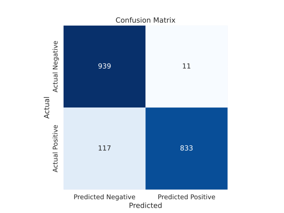
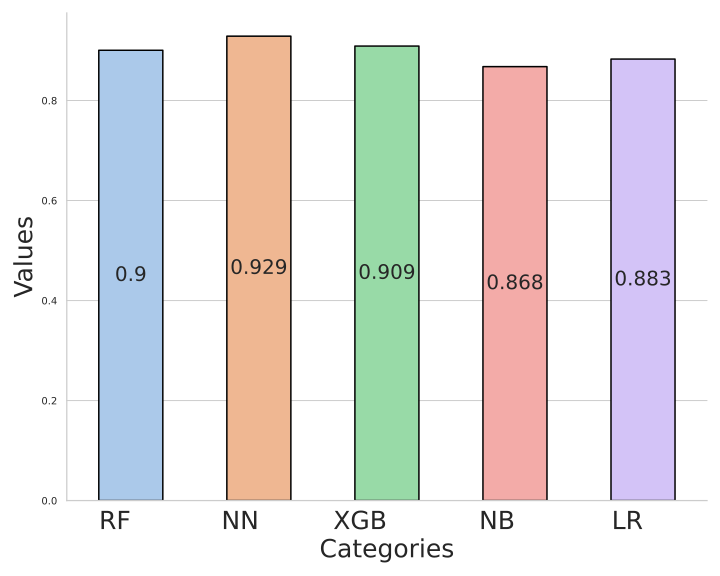
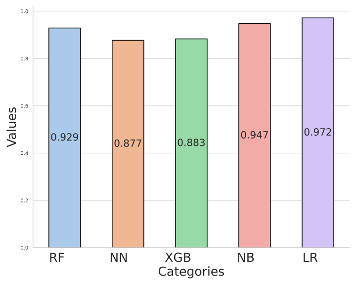
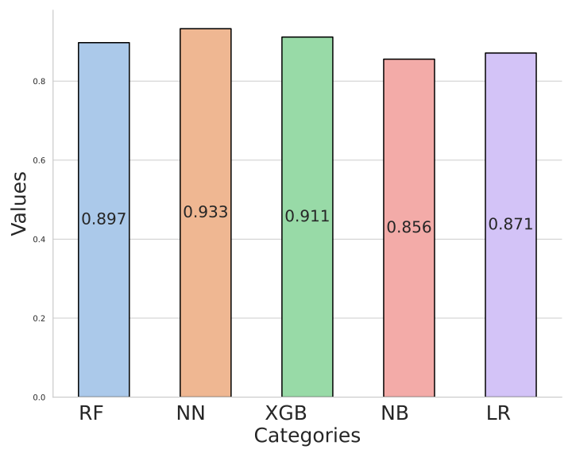

# A Comparison of Machine Learning Algorithms for Binary Classification of Stroke Outcome - A Very Simple Overview

Stroke is the second leading cause of death [worldwide](\cite{https://www.ncbi.nlm.nih.gov/pmc/articles/PMC7944424/}) and the primary cause of disability in developed [countries](https://www.ncbi.nlm.nih.gov/pmc/articles/PMC7944424). According to the World Health Organization, and estimated 15 million strokes take place each year, causing the death of approximately 5 million people in addition to another 5 million people being left permanently disabled. Here I have developed several machine learning algorithms to predict if a person will have a stroke based on a number of health parameters: like age, hypertension and marrital status. The data used here is from this fantastic [Kaggle Dataset](https://www.kaggle.com/datasets/fedesoriano/stroke-prediction-dataset).

## Approaching the Data

The dataset consisted of 11 clinical features: both categorical and continuous. Bellow are some general observations which could be made regarding the distribution of the data. This was found by creating a number of different plots comparing how different variables relate.

First, the majority of individuals had been married and interestingly a higher portion of married patients had stroke than those who were not married. Furthermore, the majority of examined individuals had neither hypertension or heart disease, but approximately the same amount of people lived in rural as in urban areas. The gender category was divided into three groups: Female, Male and Other. More females were examined than males, but they were both reasonably close, while a very small amount of individuals were in the Other group. The majority of patients had never smoked, and the formerly smoked had slightly more samples than the smokes category. The category also had a substantial amount of unknown cases. For the work type category, the majority of people worked in the private sector while approximately the same number of people worked in a government job, was self employed or the individual was a child. A very small amount had never worked. The No Stroke patients are distributed rather evenly for all ages, whereas the Stroke cases are mostly clustered among older ages. The same can be said for the average glucose level, but no clear correlation exists for the bmi. Hypertension and heart disease also had a positive correlation with stroke.

Given these observations, during the data preprocessing a health score was added which computed a value combining several "healh-related" parameters. Additionally, since the dataset was unbalanced with substantially more cases without stroke the over-sampling technique SMOTE was used. Finally, some of the data was binned and some data which seemed redundant was dropped. 

## Meeting the Models

When the data had been processed it was time to feed it into the models. The models which were used include:
- Random Forest
- Neural Network
- Naive Bayes
- XGBoost
- Logistic Regression
These models were all used due to their ability to capture complex patterns especially in high-dimensional data. A lot of beautiful mathematics could be discussed here, but that is outside the scope of this short presentation.

## Analyzing the Results

When working with classification tasks, a number of different performance metrics can be evaluated. One can, for example, not always use accuracy as if a dataset is severely unbalanced then always predicting one outcome might give a good accuracy, even though your model is barely doing anything. As such, throughout the process a number of metrics were compared. Bellow are some of the confusion matrices obtained from the models (on the test data).

Logistic Regression             |  Neural Network
:-------------------------:|:-------------------------:
  |  

Random Forest             |  Naive Bayes
:-------------------------:|:-------------------------:
  |  

XGBoost            |
:-------------------------:|
  

From these plots the precision, accuracy, recall and F1 score was computed. These metrics represent a model's ability to predict both true positives and true negatives, and as such should give a comprehensive overview of the actual model. 

F1            |  Precision
:-------------------------:|:-------------------------:
  |  

 Recall            |  Accuracy
:-------------------------:|:-------------------------:
  |  

These plots show that the models in general are very similar in performance, but that depending on what metrics you are evaluating, some of the models stand out. 

For instance, the model with the best accuracy was the neural network with 93.3\%, whereas the model with the best recall was the logistic regression with 97.2\% while the neural network scored 87.7\%. The model with the best precision was, however, also the neural network (98.7\%) as well as the F1-score (92.9\%). As a consequence of the different strengths, no algorithm can be deemed the best. Despite, that the neural network attained the best scores on 4 out of 5 evaluation metrics, it achieved the worst recall score. Therefore, it must simply be stated that the different algorithms have different strengths. To determine what algorithm to use, the consequences of incorrect classification must be discussed since long term stroke prediction would be a diagnosis method which could seriously alter a persons life.

To conclude, the different machine learning algorithms created models which behaved in different ways and consequently obtained different scores for the different evaluation metrics. However, all of the developed models showed significant values for all of the metrics and further development of machine learning models for classification of stroke might be important for improving early diagnosis of stroke.  
